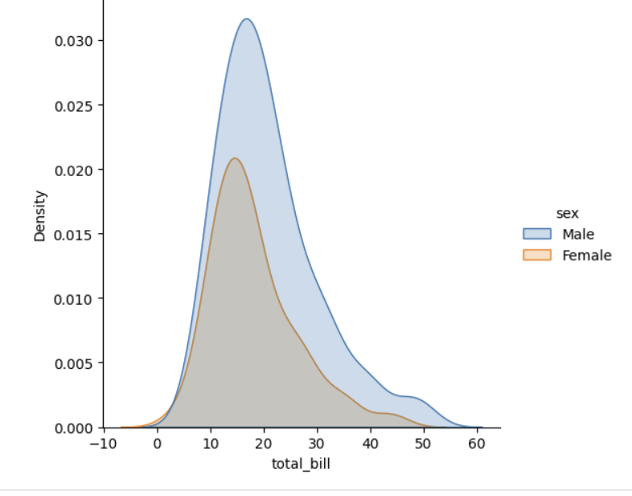
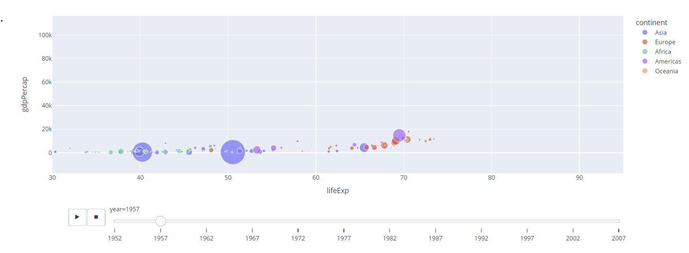

# 📊 Data Visualization with Python

A collection of hands-on Python notebooks covering **data visualization using Matplotlib, Seaborn, and Plotly**.

This repository contains practical examples of different charts, plot customization techniques, and interactive visualizations used in **Exploratory Data Analysis (EDA)** and data analysis.

## 📚 Libraries Covered

### Matplotlib

- Line plots
- Bar charts
- Scatter plots
- Histograms
- Pie charts
- Subplots
- Plot customization

### Seaborn

- Relational plots
- Distribution plots
- Categorical plots
- Regression plots
- Heatmaps
- Pair plots
- Plot customization

### Plotly

- Interactive scatter plots
- Line charts
- Bar charts
- Histograms
- Box plots
- Interactive visualizations
- Advanced and customized charts

## 📸 Visualization Examples

### Matplotlib

### Seaborn

### Plotly

## 🎯 Purpose

The goal of this repository is to build a strong foundation in **Python data visualization** through practical examples and hands-on exploration of different visualization libraries.

## 🛠️ Tools & Technologies

- Python
- Pandas
- NumPy
- Matplotlib
- Seaborn
- Plotly
- Jupyter Notebook / Google Colab

│   └── plotly-animation.png
│
└── README.md
